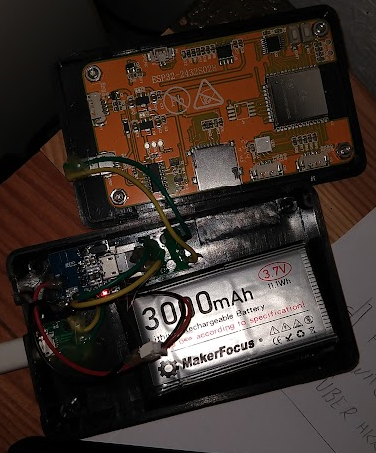
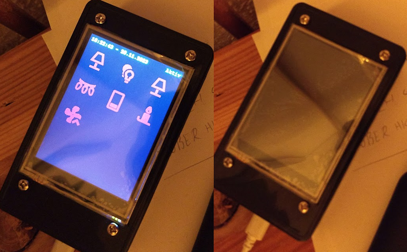

# Touchswitch-based-on-ESP32-2432S028R
*a basic multitouch switch with 12 Icons based on ESP-2432S028R*

### Content
1. Basic info
2. How to use and what to change
3. Hardware example

## Basic info

My basic yml-Code was inspired by the repository of ```BOlaerts``` which you can finde here: https://github.com/BOlaerts/ESP32-2432s028. There are all pinout information for esphome which I needed and some more info. The board itself I bought on aliexpress for around 12€ including shipping.

I wannted to create an battery driven handsized touch device to handle my smarthome setup based on home assistant. The current yml is a bit a mess but it works :-) The display turns of after a specified among of time to save battery.


## How to use and what to change

### First config and Installation

At the begin I created a new device config in esphome, which already takes some preconfigured information like:
1. ```api key```
2. ```wifi info```
3. ```ota info```

I choosed the ```esp32``` plattform and configured the needed line in my simple .yml like this:

```yml
esp32:
  board: esp32dev
  framework:
    type: arduino
```

After that I installed the esp32 firmware.bin by connecting the board by USB to my PC. Every update since then is done by OTA.

### What you have to change in the other code

#### Rotation
I had ordered another of these displays and installed this code. The display was rotated by 90°. A view on the project pages shows the following:

[ILI9xxx TFT LCD Series from ESPHome](https://esphome.io/components/display/ili9xxx.html)

> The rotation variable will do a software based rotation. It is better to use the transform option to rotate the display in hardware. Use one of the following combinations: - 90 degrees - use swap_xy with mirror_x - 180 degrees - use mirror_x with mirror_y - 270 degrees - use swap_xy with mirror_y.

So I added the following to the display section:
```yml
  transform:
    swap_xy: true
    mirror_x: true
    mirror_y: false
```

#### Timer
In the ```globals``` you find the variable ```max_timer```. This is the time in seconds, thich the displays stay on after the last touchevent. In my case I have chosen 20s.

#### Colors
In the ```color``` section you can create your wanted colors to used them later on in the code. To create the needed colors i wanted to find a colorpicker which shows the percentage values. I often only found some ```hsl``` pciker. But here you have one: https://convertingcolors.com/.

#### Images
In the ```images``` section you can create your need icons. Some Examples are used and included. The ```id``` is important for using it later on.

#### Touchsensors (what should be triggered)
In the ```binary_sensor``` section the fun (and maybe the mess) begins. There you will find 12 touchscreen sensors. In each of them is a ```on_press``` lambda function which calls the HA switch service. here you have to add your ```entity_id``` you want to toggle. So replace ```your_entity_id1``` with one of you switches. The order is important later on.

#### Status Binary Sensors (for coloring the status of icons)
In the same section 12 ```homeassistant``` sensors are listed. Here you should replace the ```your_entity_id1``` ids in the same order as you add them in the lamda function above. So you can keep track of your changes.

#### Displaying everything
The final act happends in the ```display``` section. In the ```lambda``` part you will find the main code for showing everything. The ```elemCount``` tells the code how many items should be shown (1 - 12). The ```icons``` and ```devices``` are simple lists which are used to render the correct icon in the correct place and colorize it based on the status of the device in the the device list. The ```icons``` list uses the ids of the images section and the ```devices``` list contains the ids of the ```binary_sensor``` platform ```homeassistant```.

#### Everything comes together
The Code in the ```lambda``` part of the ```display``` section places the icons in calculated positions and colorize them by the status of the device which has the same index in the ```devices``` list as the icon in the ```icons``` list. The calculated coords are the same coords like I used above in the ```binary_sensor``` section with platform ```touchscreen```. If you want to rearange the icons you need to change the calculation in the code (```15 + 80 * j, 30 + 70 * i```), which generates the raster and change the values on the touchsensors. Both should match. The following code is generated with ```i = 0``` and ```j = 0```. The size is taken from the ```images``` section: ```resize: 50x50```

```yml
    x_min: 15
    x_max: 65
    y_min: 30
    y_max: 80
```

```js
15 + 80 * 0, 30 + 70 * 0 
// => 15 for x_min
// => 30 for y_min
// => x_min + 50 = x_max = 65
// => y_min + 50 = y_max = 80
```

## Hardware

#### List of pieces
1. 3.7V 3000mAh Lithium Battery
2. YOUMILE DIY MICRO USB PORT for solderin
3. AZDelivery Power Bank Modul Loading regulator
4. XLX DIY MICRO USB Jack for solderin
5. DIY USB Jack Type A for solderin
6. ESP32-2432S028R 240*320 Screen
7. case with 10 x 6 x 2.5 cm
8. some cable
9. some screws



My screen was delivered in a small case as you see on many pictures on google or in this blogpost here: https://arduino-tex.ru/news/164/hmi-displei-s-rezistivnym-sensorom-na-esp32-28-dyuima.html It has nearly the same messurements like the black case and can maybe used as case, too.

#### Resulte (e.g. with 7 icons)

